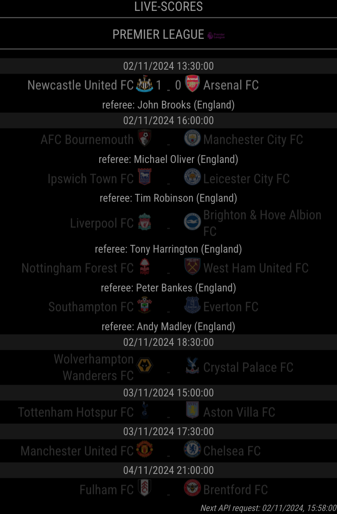
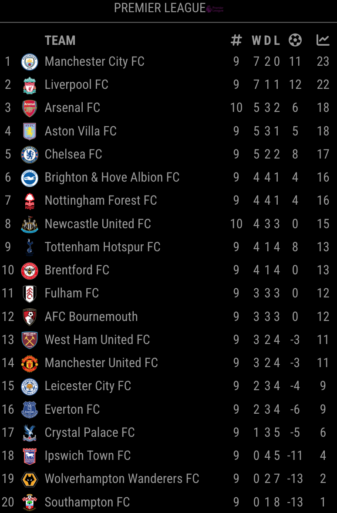
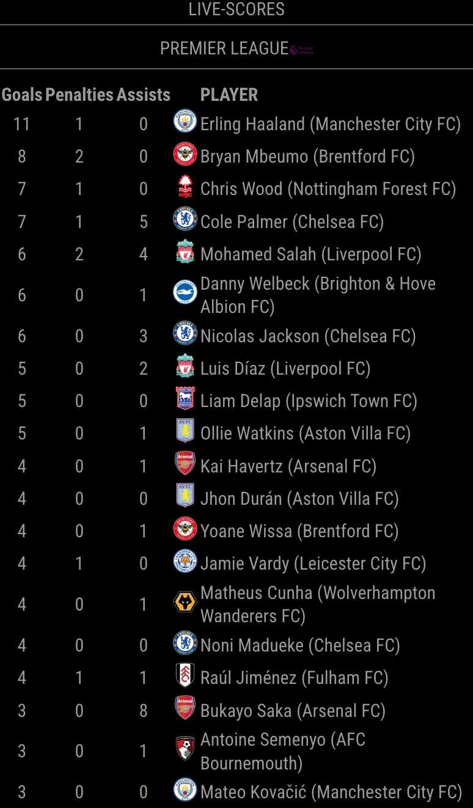

# MMM-SoccerLiveScore

This a module for the [MagicMirror²](https://github.com/MagicMirrorOrg/MagicMirror).  
It displays live scores of your favorite soccer leagues and competitions.

## Preview

### Standing



### Table



### Scorers




## Installation

1. Navigate into your MagicMirror's `modules` folder and execute `git clone https://github.com/0m4r/MMM-SoccerLiveScore`.
2. from the MMM-SoccerLiveScore folder run `npm ci`
3. Prepare your configuration
4. Restart your MagicMirror

## Config

The entry in `config.js` can include the following options:

| Option           | Description                                                                                                                                                                                                                                                                                                                                                                |
| ---------------- | -------------------------------------------------------------------------------------------------------------------------------------------------------------------------------------------------------------------------------------------------------------------------------------------------------------------------------------------------------------------------- |
| `token`          | API Token, it can be obtained from https://www.football-data.org/pricing (a free plan is avaiable)                                                                                                                                                                                                                                                                         |
| `leagues`        | List of league-ID's you want to display. If you put more than one league the module switches automatically between them. **Type:** `Array`<br>**Example:** `[2000]` <br>This value is **REQUIRED**                                                                                                                                                                         |
| `displayTime`    | defines how long the information for a league in `leagues` is shown on the screen. This screen time is used to display standings, tables and scorers. For example, if you specify `displayTime` to 30 seconds and `showTables=true`, `showStandings=true`and `showScorers=true` each information will be shown for about 10 seconds. <br><br>**Default value:** 20 \* 1000 |
| `showNames`      | Toggles teams names. <br><br>**Default value:** `true`                                                                                                                                                                                                                                                                                                                     |
| `showLogos`      | Toggles team logos.<br><br>**Default value:** `true`                                                                                                                                                                                                                                                                                                                       |
| `showStandings`  | displays the standings for the league <br><br>**Default value:** `true`                                                                                                                                                                                                                                                                                                    |
| `showTables`     | displays the tables for the league (if available) <br><br>**Default value:** `true`                                                                                                                                                                                                                                                                                        |
| `showScorers`    | displays the scorers for the league (if available) <br><br>**Default value:** `true`                                                                                                                                                                                                                                                                                       |
| `scrollVertical` | scroll the module vertically (up and down) <br><br>**Default value:** `true`                                                                                                                                                                                                                                                                                               |

Here is an example of an entry in `config.js`

```js
{
  module: 'MMM-SoccerLiveScore',
  header: 'Live-Scores',
  config: {
    leagues: [2019, 2021, 2000],
    displayTime: 60 * 1000,
    requestInterval: 2 * 60 * 1000, // 2 mins
    showNames: true,
    showLogos: true,
    showStandings: true,
    showTables: true,
    showScorers: true,
    scrollVertical: true,
    logostToInvert: [109], // some teams logo are not visible on dark background
    token: [YOUR_ROKEN_FROM_FOOTBALL_DATA_ORG],
    requestsAvailablePerMinute: [MAX_CALL_PER_MINUTE], // varies with subscription type to https://www.football-data.org/pricing
  }
},
```

## Leagues

The available leages depeneds on the type of subscriptin you own for https://www.football-data.org/pricing.  
All the avaialble leagues are listed here: https://docs.football-data.org/general/v4/lookup_tables.html#_league_codes (in the module configuration you must use the `Competition Id`)  

  
## Special Thanks

- [Michael Teeuw](https://github.com/MichMich) for creating the awesome [MagicMirror²](https://github.com/MagicMirrorOrg/MagicMirror/tree/develop) project that made this module possible.
- [mrtysn](https://github.com/mrtysn) for starting the MMM-soccerLiveScore module, where from this code has been forked (<https://github.com/mrtysn/MMM-SoccerLiveScore>)
